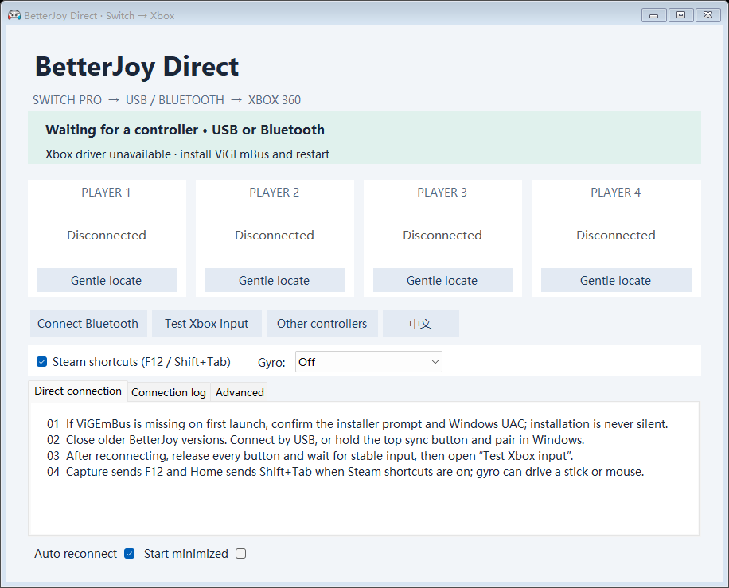

<div align="center">

# BetterJoy Direct

**Switch controllers in. Stable Xbox input out.**

A focused Windows x64 fork of [BetterJoy](https://github.com/Davidobot/BetterJoy) with safer reconnects, live gyro controls, and a clean bilingual interface.

<p>
  
  
  
  <a href="LICENSE"></a>
</p>

<p>
  <a href="README.md"><strong>English</strong></a>
  ·
  <a href="README.zh-CN.md">简体中文</a>
  ·
  <a href="https://github.com/zzirui321-rgb/BetterJoy-Direct/releases">Releases</a>
  ·
  <a href="#quick-start">Quick start</a>
  ·
  <a href="#documentation">Documentation</a>
</p>

</div>

---

> [!NOTE]
> BetterJoy Direct converts supported Nintendo Switch controllers into virtual Xbox 360/XInput devices. Steam is optional; the core USB/Bluetooth-to-XInput path does not depend on it.

## Why BetterJoy Direct?

| | |
|---|---|
| **🎮 Direct XInput**<br>Use Switch Pro Controllers and Joy-Cons as virtual Xbox 360 controllers through ViGEmBus. | **🛡️ Safer reconnects**<br>Reject malformed HID reports, wait for a neutral release baseline, and clear stale output after reconnecting. |
| **🧭 Live gyro modes**<br>Switch between off, left stick, right stick, and mouse without reconnecting the controller. | **🌐 Bilingual interface**<br>Change between English and Chinese at runtime in a resizable, tray-safe window. |
| **⌨️ Steam shortcuts**<br>Optionally map Capture to `F12` and Home to `Shift+Tab`, with press-edge protection. | **📍 Gentle locate**<br>Find a controller with a short, strength-limited rumble that cannot stack from repeated clicks. |

<p align="center">
  
</p>
<p align="center"><sub>Four controller slots, connection diagnostics, runtime gyro controls, and one-click language switching.</sub></p>

## Quick start

### 1. Prepare the virtual-controller driver

- Windows 10 or Windows 11 x64
- A Switch Pro Controller or supported Joy-Con over USB or Bluetooth

The complete x64 release includes the upstream-provided ViGEmBus `1.17.333.0` x64 installer, Authenticode-signed by Nefarius Software Solutions e.U. On first launch, BetterJoy Direct detects a missing driver and asks before starting the installer. Windows then displays its normal UAC prompt. The driver is never installed silently; choosing **No** leaves the interface available but disables virtual Xbox/XInput output.

ViGEmBus is a system driver, so it cannot be made portable and still requires one administrator-approved installation. The upstream project has been retired; BetterJoy Direct bundles the existing signed installer for compatibility but does not maintain or re-sign it. Its version and SHA-256 are recorded in [`Drivers/README.txt`](BetterJoyForCemu/Drivers/README.txt).

### 2. Download and connect

1. Download the portable ZIP from [GitHub Releases](https://github.com/zzirui321-rgb/BetterJoy-Direct/releases), then extract the complete archive.
2. Close older BetterJoy instances and other mappers that may open the same physical controller.
3. Run `BetterJoyForCemu.exe`.
4. If prompted, choose **Yes**, approve Windows UAC, and complete the bundled ViGEmBus installer. Restart BetterJoy Direct or Windows if requested.
5. Connect over USB, or hold the controller's sync button and pair it in Windows Bluetooth settings.
6. After connecting or reconnecting, release every button and wait at least **300 ms** for the neutral-input gate.
7. Select **Test Xbox input** and verify the controller in the Windows game-controller panel.

> [!TIP]
> Regular buttons and sticks produce XInput, so Windows Explorer will not react to them. Gyro mouse mode moves the pointer directly.

> [!IMPORTANT]
> Avoid letting Steam Input and BetterJoy map the same physical controller at the same time. That can produce duplicate input. HidHide remains an optional user-managed setup; BetterJoy Direct does not change device-hiding rules automatically.

## Runtime controls

| Control | Output | Best for |
|---|---|---|
| **Steam shortcuts** | Capture → `F12`; Home → `Shift+Tab` | Steam screenshots and overlay access |
| **Gyro off** | No converted motion output | Standard Xbox control |
| **Gyro → left stick** | Virtual left-stick movement | Experimental movement control |
| **Gyro → right stick** | Virtual right-stick movement | Broad game compatibility and aiming |
| **Gyro → mouse** | Direct Windows pointer movement | Mouse-camera games and desktop use |

Xbox/XInput has no standard native gyro field. Applications with DSU/Cemuhook support can use the optional motion server instead. For local Steam games, Steam Input may provide smoother native gyro handling; exit BetterJoy or prevent Steam from also reading the physical controller to avoid double input.

## Reliability pipeline

```text
Switch Pro / Joy-Con
        │ USB or Bluetooth HID
        ▼
report validation → reconnect release gate → calibration and parsing
        │
        ├─ ViGEmBus → Xbox 360 / XInput → game or remote client
        ├─ optional Steam shortcuts → F12 / Shift+Tab
        ├─ optional gyro → left stick / right stick / mouse
        └─ optional motion server → DSU/Cemuhook data
```

BetterJoy Direct only launches the bundled driver installer after explicit confirmation and Windows UAC; it never installs a driver silently. It does not change Steam settings, HidHide, or Windows device-hiding rules. Remote-control software must provide its own gamepad-forwarding channel; BetterJoy Direct cannot add controller transport to an arbitrary remote protocol.

## Verification snapshot

| Area | Result |
|---|---|
| Input regression | **343 checks passed** — report bounds, all 256 report IDs, timestamps, reconnect gating, calibration, deadzones, Steam shortcut edges, gyro direction, and Guide suppression |
| UI and behavior | **38 checks passed** — bilingual text, driver onboarding, runtime settings, resizing, and tray restore |
| Virtual Xbox lifecycle | **3 consecutive cycles passed** — create, move, neutralize, and disconnect |
| Physical hardware | **704 XInput samples** — Switch Pro over Bluetooth, including physical disconnect and automatic reconnect |

The verified physical path is a Switch Pro Controller over Bluetooth. USB, other controller models, individual games, anti-cheat systems, and specific remote-control applications still need validation in their own environments.

## Build from source

Building requires Windows, Python 3, and the .NET Framework 4.6.1 Developer Pack or a compatible newer .NET Framework 4.x build environment. Dependencies are restored inside the repository rather than installed globally.

```powershell
python tools/restore.py
.\build-direct.ps1
.\test-direct.ps1
.\test-features.ps1
```

With ViGEmBus installed, also run the virtual-controller lifecycle test:

```powershell
.\test-xbox-output.ps1
```

Create the portable archive with:

```powershell
python tools/package-direct.py
```

Generated binaries, hardware logs, downloaded tool archives, build caches, and release ZIP files are excluded from Git.

## Documentation

| Document | Purpose |
|---|---|
| [Feature and configuration reference — 中文](docs/FEATURES.zh-CN.md) | Data flow, runtime controls, advanced settings, limits, and troubleshooting |
| [Development journey — English](docs/DEVELOPMENT-JOURNEY.md) | How the project moved from diagnosis to a tested Direct build |
| [开发历程 — 中文](docs/DEVELOPMENT-JOURNEY.zh-CN.md) | 中文版开发过程与关键取舍 |
| [Architecture decision](docs/direct-mode-decision.md) | Direct-mode scope, boundaries, and rejected alternatives |
| [Changelog](CHANGELOG.md) | User-visible changes across Direct milestones |
| [Original upstream README](docs/UPSTREAM-README.md) | Original instructions, acknowledgements, and project history |

## Upstream and license

BetterJoy Direct is an independent derivative of [Davidobot/BetterJoy](https://github.com/Davidobot/BetterJoy), based on upstream commit `b6715638a3ed1084f8968e8cafebbc6fe2ed0096`. It is not an official BetterJoy release; upstream authors and contributors retain credit for the original project.

The project remains under the [MIT License](LICENSE). The portable archive also carries the available license or package metadata for bundled third-party dependencies.
