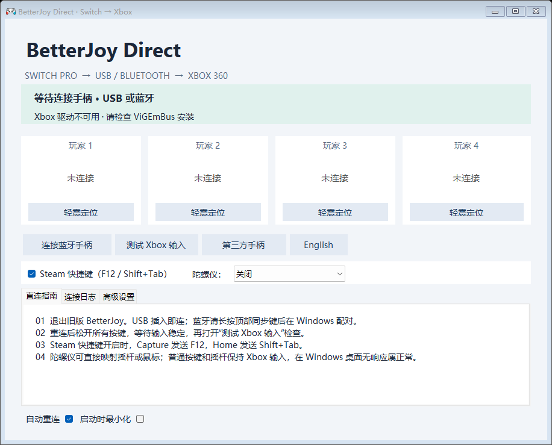

# BetterJoy Direct

[English](README.md) | [简体中文](README.zh-CN.md)

BetterJoy Direct 是 [Davidobot/BetterJoy](https://github.com/Davidobot/BetterJoy) 的 Windows x64 分支，基于上游提交 `b6715638a3ed1084f8968e8cafebbc6fe2ed0096`。

它保留 BetterJoy 将 Nintendo Switch 手柄转换为 Xbox 360/XInput 的核心链路，同时加强重连安全、提供运行时陀螺仪控制、简化桌面输入行为，并用可缩放的中英文界面替换旧窗口。



## 主要改进

- 将 USB 或蓝牙连接的 Switch Pro Controller 与 Joy-Con 通过 ViGEmBus 转换为虚拟 Xbox 360/XInput 手柄。
- 输出按键或摇杆前验证 HID 输入报文，并在首次连接或重连后等待全部按键释放和稳定的中立输入。
- 创建虚拟手柄时主动清除 Windows 可能残留的旧 XInput 轴状态。
- 提供立即生效的陀螺仪模式：关闭、映射左摇杆、映射右摇杆或映射鼠标。
- 提供可关闭的 Steam 快捷键：Capture 发送 `F12`，Home 发送 `Shift+Tab`。
- 提供现代中英文界面、四个手柄卡片、连接日志、Windows 蓝牙与手柄测试入口，并修复窗口缩放和托盘恢复行为。
- 将原来较强的定位震动改为受强度限制的温和短脉冲。
- 删除容易误解的自定义键鼠映射开关及全局输入监听；普通按键和摇杆始终保持 Xbox 输入。

## 下载与运行要求

从 [GitHub Releases](https://github.com/zzirui321-rgb/BetterJoy-Direct/releases) 下载当前便携 ZIP，完整解压后运行 `BetterJoyForCemu.exe`。

运行要求：

- Windows 10 或 Windows 11 x64
- 已安装 [ViGEmBus](https://github.com/nefarius/ViGEmBus) 驱动
- 通过 USB 或蓝牙连接的 Switch Pro Controller 或受支持的 Joy-Con

便携包不会安装或修改驱动、Steam 设置、HidHide 或 Windows 设备隐藏规则。ViGEmBus 上游已经停止维护；本项目复用已安装驱动，不替换它的内核组件。

## 首次使用

1. 退出其它 BetterJoy 实例，以及可能同时打开物理手柄的映射软件。
2. USB 可直接连接；蓝牙请长按手柄同步键，然后在 Windows 蓝牙设置中配对。
3. 首次连接或重连后松开全部按键，等待至少 300 毫秒，让中立输入保护完成。
4. 点击 **测试 Xbox 输入** 打开 Windows 游戏控制器面板，再在那里或游戏中检查按键与摇杆。

普通按键和摇杆输出 XInput。Windows 资源管理器不会用 XInput 控制桌面，因此桌面无响应属于正常现象。陀螺仪鼠标会直接产生光标移动。部分游戏不能同时接收鼠标和手柄输入，或者会在两种输入提示之间切换。

## 运行时控制

| 控件 | 行为 |
|---|---|
| Steam 快捷键 | Capture → `F12`；Home → `Shift+Tab` |
| 关闭陀螺仪 | 仍读取运动数据，但不转换为游戏输入 |
| 陀螺仪 → 左摇杆 | 将运动量叠加到虚拟左摇杆 |
| 陀螺仪 → 右摇杆 | 将运动量叠加到虚拟右摇杆，兼容面最广 |
| 陀螺仪 → 鼠标 | 直接移动 Windows 光标，不需要其它映射开关 |

Xbox/XInput 没有标准的原生陀螺仪字段。支持 DSU/Cemuhook 的软件可以改用可选 Motion Server。本地 Steam 游戏由 Steam Input 直接处理物理 Switch 手柄时可能更顺滑；应避免 Steam 与 BetterJoy 同时映射同一个物理设备。

## 从源码构建

构建需要 Windows、.NET Framework 4.6.1 Developer Pack 或兼容的更新 4.x 构建环境，以及 Python 3。依赖只恢复到项目目录，不进行全局安装。

```powershell
python tools/restore.py
.\build-direct.ps1
.\test-direct.ps1
.\test-features.ps1
```

安装 ViGEmBus 后还可以验证虚拟手柄生命周期：

```powershell
.\test-xbox-output.ps1
```

生成便携包：

```powershell
python tools/package-direct.py
```

生成的程序、硬件日志、下载的工具压缩包和构建缓存不会进入 Git。正式 ZIP 应作为 GitHub Release 附件发布，不写入仓库历史。

## 验证状态

- 343 项输入回归覆盖报文边界、全部 256 个 report ID、重复时间戳与回绕、重连释放门、死区、无效校准、Steam 快捷键按下沿、陀螺仪 Y 方向、Guide 抑制、组合 Joy-Con 快捷键所有权，以及旧键鼠监听已删除。
- 32 组双语文案及运行时语言、Steam 快捷键、陀螺仪、窗口缩放和托盘恢复行为通过功能回归。
- 虚拟 Xbox 生命周期在开发电脑上连续三轮完成创建、移动、归零与断开。
- 实体 Switch Pro 蓝牙测试记录 704 个 XInput 样本、一次物理断开和成功自动重连；最终四轴归零且没有输出错误。

已验证的实体链路是 Switch Pro 蓝牙。USB、其它手柄型号、具体游戏、反作弊和具体远程控制软件仍需在各自环境中验证。

远程控制软件必须自身支持游戏手柄转发；BetterJoy Direct 不能为任意远程协议自动增加手柄通道。

## 文档

- [功能与配置说明](docs/FEATURES.zh-CN.md)
- [Development journey — English](docs/DEVELOPMENT-JOURNEY.md)
- [开发历程 — 中文](docs/DEVELOPMENT-JOURNEY.zh-CN.md)
- [架构决策](docs/direct-mode-decision.md)
- [更改日志](CHANGELOG.md)

## 上游与许可证

BetterJoy Direct 是 [Davidobot/BetterJoy](https://github.com/Davidobot/BetterJoy) 的独立衍生版本，并非 BetterJoy 官方发布。原项目作者和贡献者继续保留完整署名。

仓库保留了[上游原始 README](docs/UPSTREAM-README.md)，其中包含原项目致谢、使用说明和历史。

项目继续使用仓库中的 [MIT License](LICENSE)。便携压缩包也附带可获得的第三方依赖许可证或包元数据。
